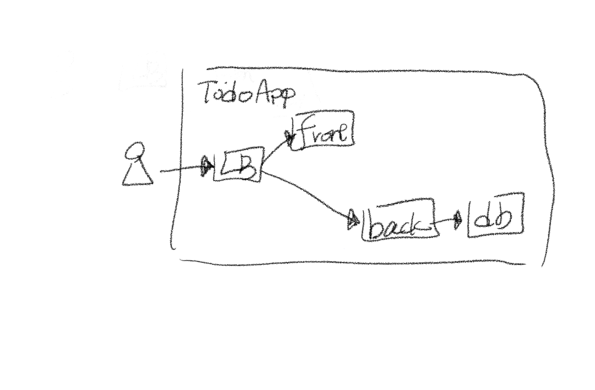
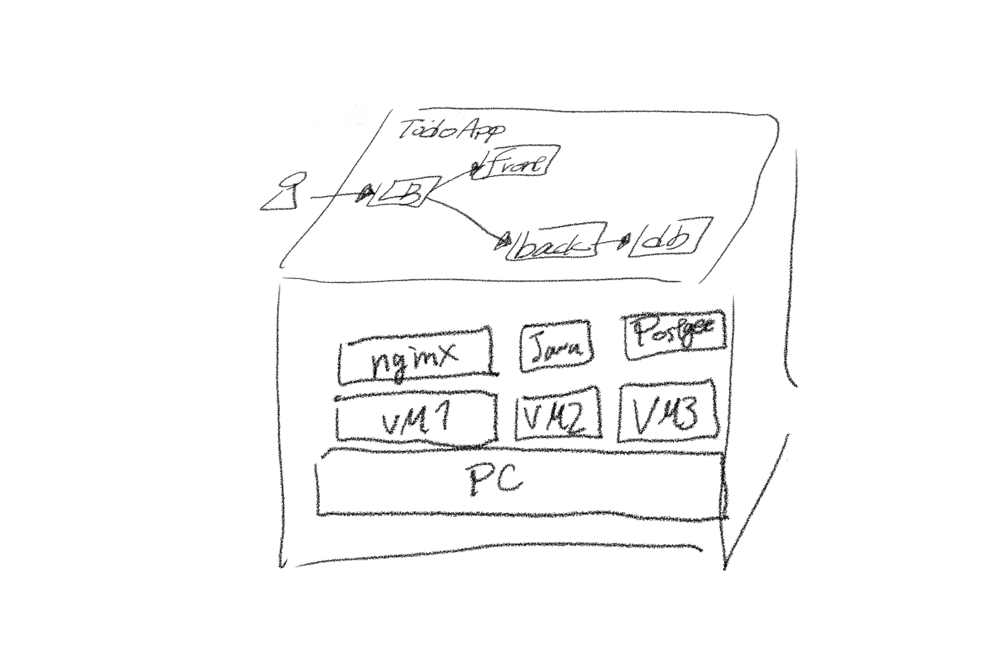
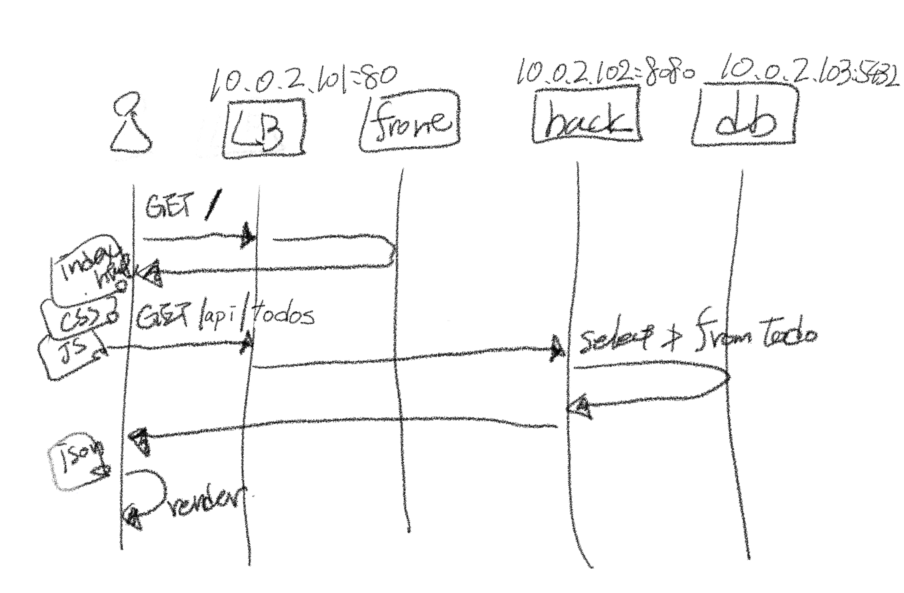

# webappの構成・通信確認のサンプル - on-prem / VM / SPA / Java

## 目的

- オンプレのシステムで描かれるシステムアーキテクチャの意図を読み取れるようになる
- SPAでの通信の流れを把握する

## やらないこと

- ネットワーク: ゲスト群とホストOSとの接続だけ
- セキュリティ: 境界防御は考えない
- 保守性: アプリケーションアーキテクチャは考慮しない
- 最近のトレンド: 通信部分の仕組みがわかるローコンテキストなライブラリだけ使う

## 元ネタ

- <https://github.com/toki-developer/TodoApp-springboot>

## 構成

### C4 / システムコンテキスト図


- 構成
  - 1システムで完結

### C4 / コンテナ図



- ポイント
  - 入口にload balancer(LB)を置いています
- 構成
  - LB: URLでfrontendとbackendを振り分ける
    - ブラウザでアクセスするのはココだけ
  - frontend: web server - HTML, CSS, JSを返す
  - backend: web API server - JSONを返す
  - db: RDBMS - データを保持する

### システム構成図



- ポイント
  - nginxでLBとweb serverを兼ねます
- 構成
  - VM
    - frontend: `10.0.2.101/24`
    - backend: `10.0.2.102/24`
    - db: `10.0.2.103/24`

### シーケンス図



- ポイント
  - nginxでの振り分け
    - `/` -> web
    - `/api` -> backend
- 構成
  - frontend VM
    - port: `80`
      - nginx
        - LB
        - web
  - backend VM
    - port: `8080`
      - Java - Spring Boot
  - db VM
    - port: `5432`
      - Postgres

## 構築

### 前提

- [virtualbox](https://www.virtualbox.org/wiki/Downloads)
- [vagrant](https://developer.hashicorp.com/vagrant/install?product_intent=vagrant)
- [ubuntu 24.04 box or ISO](https://portal.cloud.hashicorp.com/vagrant/discover?query=ubuntu24.04)
- なんらかのSQL client

### db VM

- VMの起動

  ```sh
  cd ./db/
  vagrant up

  # 停止
  # vagrant halt
  ```

- postgresのインストール
  - ホストOS

    ```sh
    # ゲストOSに入る
    vagrant ssh
    ```

  - ゲストOS(ubuntu)

    ```sh
    # パッケージの最新化
    sudo apt update
    sudo apt -y upgrade

    # インストール
    sudo apt -y install postgresql-16

    # postgres cli clientのインストール確認
    psql --version

    # server processの設定
    sudo systemctl enable postgresql@16-main
    # serverの起動確認
    systemctl status postgresql@16-main
    ```

- postgres設定
  - ゲストOS(ubuntu)

    ```sh
    # 外部からのアクセスを許可
    sudo vi /etc/postgresql/16/main/postgresql.conf
    # 書き換えポイント
    #   listen_addresses = '*'
    #   ssl = off

    # SSLなしでのアクセスを許可
    echo 'host all all 10.0.2.0/24 trust' | sudo tee -a /etc/postgresql/16/main/pg_hba.conf

    # OSユーザーをpostgresに切り替えて、postgres内に、アプリのユーザー、DBを作成
    sudo su - postgres
    psql -c "create user todo_user with password 'todo_pass';"
    psql -c "create database todo_db with owner todo_user;"
    psql -c "grant all privileges on database todo_db to todo_user;"

    # OSユーザーをvagrantに戻して、postgresのアプリユーザーとしてテーブルを作成
    exit
    psql -h 10.0.2.103 todo_db todo_user --password
    # todo_pass

    -- テーブル作成
    create table todo_items(
      id serial,
      title varchar(40),
      done_flg numeric(1) default 0,
      time_limit date
    );
    quit
    ```

- SQL clientで接続
  - host: `10.0.2.103`
  - port: `5432`
  - user: `todo_user`
  - pass: `todo_pass`
  - db: `todo_db`

### backend VM

- VMの起動

  ```sh
  cd ./backend/
  vagrant up

  # 停止
  # vagrant halt
  ```

- Javaのインストール
  - ホストOS

    ```sh
    # ゲストOSに入る
    vagrant ssh
    ```

  - ゲストOS(ubuntu)

    ```sh
    # パッケージの最新化
    sudo apt update
    sudo apt -y upgrade

    # インストール
    sudo apt -y install openjdk-21-jdk

    # 環境変数の設定
    sudo touch /etc/profile.d/java.sh
    echo 'export JAVA_HOME=$(dirname $(dirname $(readlink $(readlink $(which java)))))' | sudo tee -a /etc/profile.d/java.sh
    echo 'export PATH=$PATH:$JAVA_HOME/bin' | sudo tee -a /etc/profile.d/java.sh
    source /etc/profile.d/java.sh

    # インストール確認
    java --version
    javac --version
    ```

### frontend VM

- VMの起動

  ```sh
  cd ./frontend/
  vagrant up
  ```

- nginxインストール
  - ホストOS

    ```sh
    # ゲストOSに入る
    vagrant ssh
    ```

  - ゲストOS(ubuntu)

    ```sh
    # パッケージの最新化
    sudo apt update
    sudo apt -y upgrade

    # インストール
    sudo apt -y install nginx

    # インストール確認
    nginx -v

    # 設定ファイルの確認
    ls -l /etc/nginx/sites-available/
    sudo cat /etc/nginx/sites-available/default
    ```

- 設定ファイルの変更
  - ゲストOS(ubuntu)

    ```sh
    # 変更前ファイルの確認
    sudo cat /etc/nginx/sites-available/default
    # 変更
    sudo cp -f /vagrant/nginx.conf /etc/nginx/sites-available/default
    # 変更後ファイルの確認
    sudo cat /etc/nginx/sites-available/default

    # 設定を反映
    sudo systemctl reload nginx
    ```

- ブラウザで確認
  - ホストOS
    - <http://10.0.2.101>

## デプロイ

### backend VM

- build
  - ゲストOS(ubuntu)

    ```sh
    cd /vagrant
    ./mvnw clean package -DskipTests=true
    # ビルド結果の確認
    ls -ltr ./target/
    ```

- run
  - ゲストOS(ubuntu)

    ```sh
    java -jar ./target/todoapp-0.0.1-SNAPSHOT.jar
    # Started TodoappApplicatio のログが出たら起動済み
    ```

- ブラウザで確認
  - ホストOS
    - <http://10.0.2.102:8080/todos>
- curlで確認
  - ゲストOS(ubuntu)

    ```sh
    # 全件取得 - ブラウザで表示されたもの
    curl -X GET http://localhost:8080/todos

    # 追加
    curl -X POST \
      --header "Content-Type: application/json" \
      --data '{"title":"todo1","done_flg":0,"time_limit":"2025-03-08"}' \
      http://localhost:8080/todos

    # 更新 - タイトル変更 & 完了
    curl -X PUT \
      --header "Content-Type: application/json" \
      --data '{"id":1,"title":"todo1-updated","done_flg":1,"time_limit":"2025-03-08"}' \
      http://localhost:8080/todos/1

    # 完了を一括削除
    curl -X DELETE http://localhost:8080/todos/done
    ```

### frontend VM

- コンテンツの配置
  - ゲストOS(ubuntu)

    ```sh
    # 公開中コンテンツをクリアして、ファイルをコピー
    sudo rm -fr /var/www/html/*
    sudo cp -r /vagrant/html/* /var/www/html/
    ```

- ブラウザで確認
  - ホストOS
    - <http://10.0.2.101>

## 動作を把握するポイント

- db
  - sql clientで、操作ごとの結果を確認
- backend
  - リクエストを受け取るソースコードを確認
    - [TodoController.java](./backend/src/main/java/com/todo/app/controller/TodoController.java)
  - 標準出力(stdout)で、操作ごとにSQLが発行されることを確認
- frontend
  - HTMLファイル
    - tableにヘッダーまでしか定義されていないことを確認
      - [index.html](./frontend/html/index.html)
  - JSファイル
    - backendで用意しているエンドポイントを叩いていることを確認
      - [index.js](./frontend/html/js/todo.js) の `$.get`, `$.ajax`
  - ブラウザ
    - デベロッパーツールを開く
    - 画面で操作: 追加
    - デベロッパーツールで確認
      - 作成すると、レスポンスでJSONが返ってくる
  - JSファイル
    - jsonからtableのデータ行を作成していることを確認
      - [index.js](./frontend/html/js/todo.js) の `$.get.then()`
